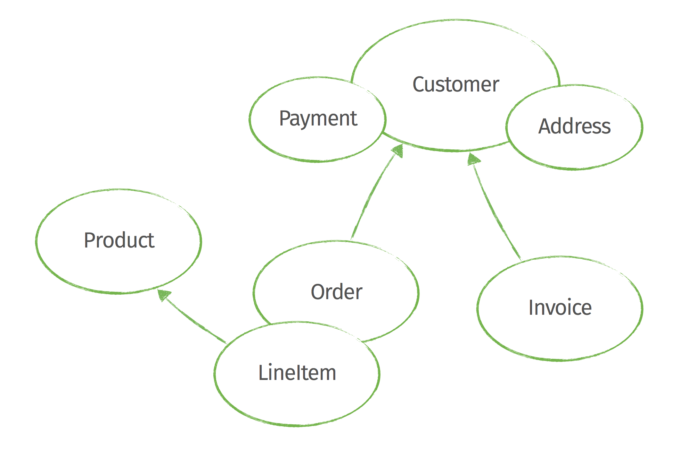
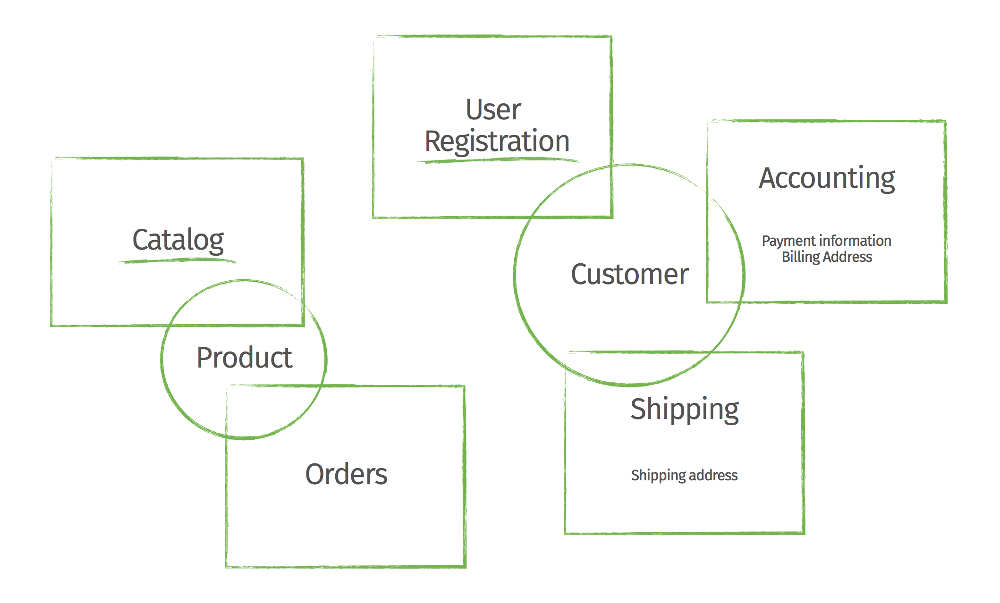
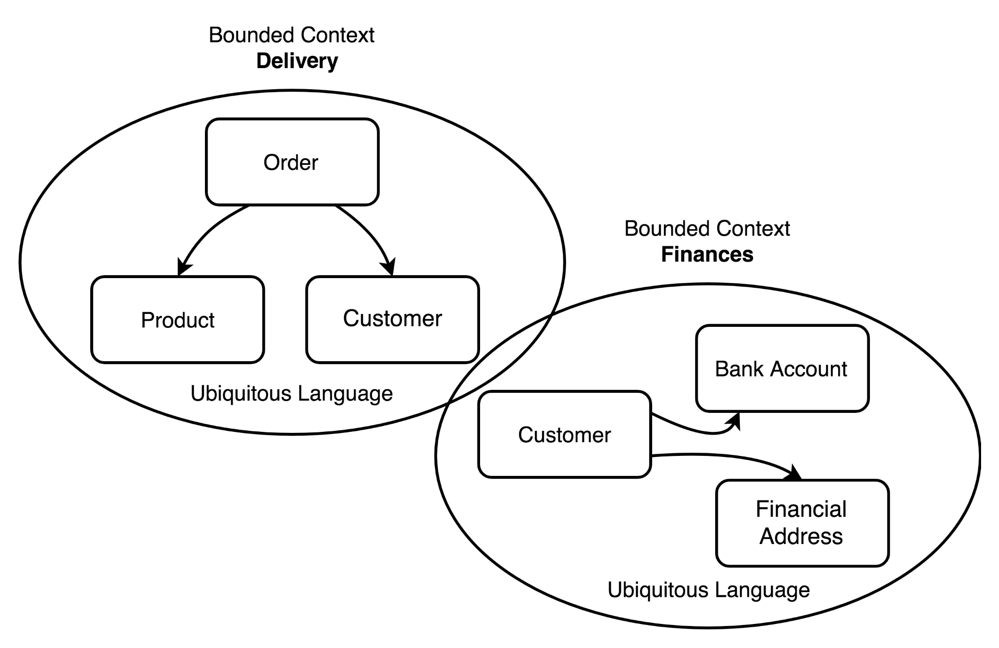
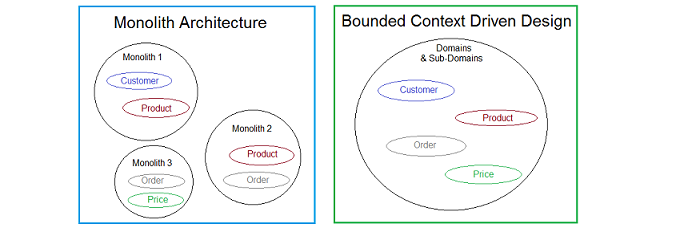

Boundary Context 

A bounded context in software architecture is a conceptual boundary within a domain where a particular domain model applies. It is a way of dividing up a large software system into smaller, more manageable pieces. Each bounded context has its own set of concepts, terminology, and rules.

or example, a software system for an online store might have several bounded contexts, such as:

* **Customer management:** This bounded context would contain the concepts of customers, orders, and shipping.
* **Product management:** This bounded context would contain the concepts of products, categories, and inventory.
* **Order processing:** This bounded context would contain the concepts of orders, payments, and shipping.

The different bounded contexts in a software system can be related to each other in different ways. For example, the customer management and product management bounded contexts might be tightly coupled, because they both need to share information about customers. On the other hand, the order processing bounded context might be more loosely coupled to the other two bounded contexts, because it only needs to interact with them when an order is placed.

The concept of bounded contexts is a key part of domain-driven design (DDD), a software development methodology that focuses on modeling the business domain of a software system. DDD uses bounded contexts to help developers understand the different aspects of the domain and to design software that is both flexible and maintainable

Here is a simple way to think about bounded contexts:

* A bounded context is a conceptual bubble that contains a set of related concepts.
* The boundaries of a bounded context are defined by the concepts that it contains.
* The concepts in a bounded context are related to each other by rules.
* The rules in a bounded context define how the concepts can be used.

**Customer management:** This bounded context would contain the concepts of customers, orders, and shipping.

**Product management:** This bounded context would contain the concepts of products, categories, and inventory

**Order processing:** This bounded context would contain the concepts of orders, payments, and shipping

